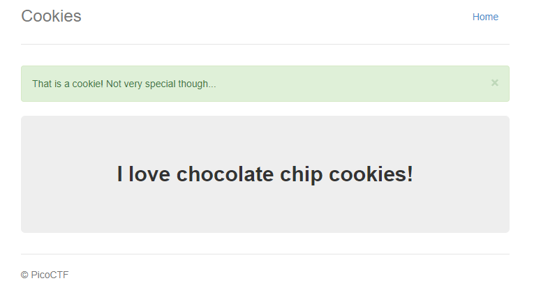

# PicoCTF 2021

## Web Exploit

Here are the web challenges that I completed in PicoCTF 2021

### Get aHEAD <a id="getahead"></a>

**Description:** Find the flag being held on this server to get ahead of the competition

**Points:** 20

#### **Solution**

The title of the challenge is interesting, the first instinct is that there is something hidden in the headers but let's look at Hints


**Hint 1:** Maybe you have more than 2 choices


Let's look at the HTML code for this

```markup
				<div class="col-md-6">
					<div class="panel panel-primary" style="margin-top:50px">
						<div class="panel-heading">
							<h3 class="panel-title" style="color:red">Red</h3>
						</div>
						<div class="panel-body">
							<form action="index.php" method="GET">
								<input type="submit" value="Choose Red"/>
							</form>
						</div>
					</div>
				</div>
				<div class="col-md-6">
					<div class="panel panel-primary" style="margin-top:50px">
						<div class="panel-heading">
							<h3 class="panel-title" style="color:blue">Blue</h3>
						</div>
						<div class="panel-body">
							<form action="index.php" method="POST">
								<input type="submit" value="Choose Blue"/>
							</form>
						</div>
					</div>
				</div>
```

You can see there are two different methods used. "GET" and "POST" so the hint is probably referring to a third method and we can see "HEAD" popping out in the title. Let's try a "HEAD" request.

```bash
 curl -I HEAD -i http://mercury.picoctf.net:53554/index.php
```

The above curl request returns the flag as expected.

**Flag:** picoCTF{r3j3ct\_th3\_du4l1ty\_2e5ba39f}

### Cookies

**Description:** Who doesn't love cookies? Try to figure out the best one.

**Points:** 40

#### **Solution**

The challenge name is "Cookies" so let's look at cookies.

The cookie set is `name=-1` , let's try changing it to 1



There is a change in the page, So we just need to find the right cookie. Using Brute force manually at I `name=18` found the flag.

**Flag:** picoCTF{3v3ry1\_l0v3s\_c00k135\_88acab36}

### Scavenger Hunt

**Description:** There is some interesting information hidden around this site. Can you find it?

**Points:** 50

#### **Solution**

By inspecting the source code I noticed this

```markup
      <div id="tababout" class="tabcontent">
		<h3>What</h3>
		<p>I used these to make this site: <br/>
		  HTML <br/>
		  CSS <br/>
		  JS (JavaScript)
		</p>
	<!-- Here's the first part of the flag: picoCTF{t -->
      </div>
```

Inspecting the CSS I noticed 

```text
/* CSS makes the page look nice, and yes, it also has part of the flag. Here's part 2: h4ts_4_l0 */
```

Assuming I will find something in the JS file too, I found `/* How can I keep Google from indexing my website? */` After a quick google search, I figured it's **robots.txt** where I found 3rd part and a hint 

```text
# Part 3: t_0f_pl4c
# I think this is an apache server... can you Access the next flag?
```

Working a lot with apache servers in the good 'ol days, I know it has to be **.htaccess**. Surpise, Surprise

```text
# Part 4: 3s_2_lO0k
# I love making websites on my Mac, I can Store a lot of information there.
```

I know Mac creates hidden files like `.DS_Store` so let's look for that

```text
Congrats! You completed the scavenger hunt. Part 5: _a69684fd}
```

Awesome!!

**Flag:** picoCTF{th4ts\_4\_l0t\_0f\_pl4c3s\_2\_lO0k\_a69684fd}

### Some Assembly Required 1

**Points:** 70

#### **Solution**

Judging by the title it probably has something to do with Assembly language, Since it's a web challenge. It's probably Web Assembly, Let's see if there is a WASM file imported.

```text
    i32.load offset=12
    local.set $var5
    local.get $var4
    i32.load offset=8
    local.set $var6
    local.get $var6
    local.get $var5
    i32.store8 offset=1072
    return
  )
  (data (i32.const 1024) "picoCTF{a2843c6ba4157dc1bc052818a6242c3f}\00\00")
)
```

There is and it also has the flag.

**Flag:** picoCTF{a2843c6ba4157dc1bc052818a6242c3f}

### More Cookies

**Description:** I forgot Cookies can Be modified Client-side, so now I decided to encrypt them!

**Points:** 90

#### **Solution**

Looking at the website, This is a continuation of the "Cookies" challenge. So let's have a look

This time the page reads "Welcome to my cookie search page. Only the admin can use it!" and the cookie is

```text
auth_name=UXVDRDhEMmNrbTFCV25jbzdheFBjbHNmOWErZnNJdnY5Nk5pUkVNTkVXYUdRK0FVSk9tTGtRT3h1a0dWSDJrbmNHSUxsRTlNR2FZZFJaZ3RRb09EdngyUnd6L3FlbCtPSmZjbnJUVE5pWnVVUHNDQ1lJdFkzbTI4N29NWWxBRU4=
```

It's a base64 but when I decode it, it's still in gibberish, So it's encrypted. Let's see the Hint


**Hint 1:** https://en.wikipedia.org/wiki/Homomorphic\_encryption


It's a Wikipedia page for a very interesting encryption method, It's more like an algorithm than an encryption formula. I found this to be the hardest challenge in the web,  Reading articles about Homomorphic encryption and looking at other writeups I understand that we do not have to decrypt it to solve it, Homomorphic encryption allows you to perform operations on encrypted text. Also, I noticed that the letters "CBC" are oddly capitalized in the challenge description. So, It's a CBC bitflip. Meaning the encrypted text contains a bit that determines if it's admin or not, so probably something like `admin=0` but I don't know it's position so I brute forced it, Here's the code

```python
from base64 import b64decode
from base64 import b64encode
import requests

def bitFlip( pos, bit, data):
    raw = b64decode(data)

    list1 = list(raw)
    list1[pos] = chr(ord(list1[pos])^bit)
    raw = ''.join(list1)
    return b64encode(raw)

ck = "UXVDRDhEMmNrbTFCV25jbzdheFBjbHNmOWErZnNJdnY5Nk5pUkVNTkVXYUdRK0FVSk9tTGtRT3h1a0dWSDJrbmNHSUxsRTlNR2FZZFJaZ3RRb09EdngyUnd6L3FlbCtPSmZjbnJUVE5pWnVVUHNDQ1lJdFkzbTI4N29NWWxBRU4="

for i in range(128):
  for j in range(128):
    c = bitFlip(i, j, ck)
    cookies = {'auth_name': c}
    r = requests.get('http://mercury.picoctf.net:25992/', cookies=cookies)
    if "picoCTF{" in r.text:
      print(r.text)
      break
```

**Flag:**  picoCTF{cO0ki3s\_yum\_82f39377}

### Who are you?

**Description:** Let me in. Let me iiiiiiinnnnnnnnnnnnnnnnnnnn

**Points:** 100

#### **Solution**

**Stage 1:**


This is the only thing I see on the website, Let's look at the hints


**Hint 1:** It ain't much, but it's an RFC https://tools.ietf.org/html/rfc2616


So, I have to set special headers for this, After looking through [**Mozilla HTTP Header Docs**](https://developer.mozilla.org/en-US/docs/Web/HTTP/Headers) ****I found a header `User-Agent` which contains information regarding the browser, So I set it to **"picobrowser"**

**Stage 2:**


After changing the header related to the browser, This is what I see. After looking through headers that relate to information regarding the previous site. I found `Referer` I changed it to the same URL.

`Referer: http://mercury.picoctf.net:39114/`

**Stage 3:**


After passing the previous stage, Now I see this. It is asking us to visit it from 2018. I know that there is a header for **"Date"**, so I changed it to a date back in 2018.

`Date: Date: Fri, 1 Dec 2018` 

**Stage 4:**


This time I need to set a header for "Do Not Track" which is `DNT`  
`DNT: 1`

**Stage 5:**


This time, We need to access this from Sweden, My first instinct was VPN but so far we only used Headers to reach here. So I looked for another header that may reveal about location, I found `X-Forwarded-For` I changed it to the first IP I found on googling "Sweden IP address"

`X-Forwarded-For: 83.254.0.167`  

**Stage 6:**


This is an easy one, I need to change the `Accept-Language` header, I set it to `sv-en` 

`Accept-Language: sv-en` 

**Result:**


Finally, we have our flag!

**Flag:** picoCTF{http\_h34d3rs\_v3ry\_c0Ol\_much\_w0w\_20ace0e4}

### Some Assembly Required 2

**Points:** 110

#### **Solution**

Like the "Some Assembly Required 1" challenge this is also related to Web Assembly. I opened the imported WASM file in Chrome Developer Tools and here's what I found towards the end \(Place where I found the flag for 1st part\)

```text
    end $label0
    local.get $var4
    i32.load offset=12
    local.set $var9
    local.get $var4
    i32.load offset=8
    local.set $var10
    local.get $var10
    local.get $var9
    i32.store8 offset=1072
    return
  )
  (data (i32.const 1024) "xakgK\5cNsmn;j8j<9;<?=l?k88mm1n9i1j>:8k?l0u\00\00")
)
```

> xakgK\5cNsmn;j8j&lt;9;&lt;?=l?k88mm1n9i1j&gt;:8k?l0u\00\00

This looks like it's encrypted, To figure out the encryption, I used **this website**. It tries all standard XOR decryptions at once. Using `XOR({'option':'Hex','string':'8'},'Standard',false)` the encrypted text outputs: `picoCTF{ef3b0b413475d7c00ee9f1a9b620c7d8}T88T88` , Great!

**Flag:** picoCTF{ef3b0b413475d7c00ee9f1a9b620c7d8}

